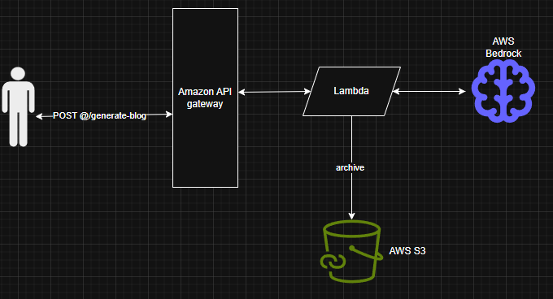

# 13-GenAI

## Architecture

Blog generation system using AWS Bedrock (Llama 3), Lambda, S3, and API Gateway.



A user sends a `POST /generate-blog` request to **Amazon API Gateway**, which triggers an **AWS Lambda** function. Lambda invokes **AWS Bedrock** (Llama 3) to generate the blog content, archives the result to **AWS S3**, and returns the blog in the HTTP response.

## Setup Steps

1. **Create S3 Bucket** for archiving blog responses
2. **Create AWS Lambda function** using Python 3.12 runtime with `app.lambda_handler` as the handler, and choose Llama 3 (`meta.llama3-8b-instruct-v1:0`) as the Bedrock model
3. **Attach IAM permissions** to the Lambda execution role — Bedrock full access (`AmazonBedrockFullAccess`) and S3 full access (`AmazonS3FullAccess`)
4. **Create API Gateway** (HTTP API) pointing to the Lambda function, expose a POST endpoint at `/generate-blog`

## Usage

**Endpoint:**
```
POST https://8p09jx44z2.execute-api.us-east-2.amazonaws.com/generate-blog
```

**Request payload:**
```json
{
    "blog_topic": "top 5 ideas for lifestyle content"
}
```

**Example response** (`200 OK`, ~7s):
```json
{
  "message": "Blog Generation is completed",
  "blog_content": "When it comes to creating engaging lifestyle content, it can be challenging to come up with fresh and relevant ideas. However, with a little creativity and inspiration, you can craft content that resonates with your audience and sets your brand apart. Here are the top 5 ideas for lifestyle content that are sure to spark some creativity:\n\nFirst up, consider creating content around self-care and wellness. With the rise of mindfulness and meditation, people are more interested than ever in taking care of their mental and physical health.\n\nNext, think about exploring the world of food and drink. Whether you're a lover of good cuisine, there's no shortage of topics to cover. From restaurant reviews to recipes and cooking techniques, you could create a wealth of content that appeals to food lovers everywhere.\n\nAnother idea is to focus on travel and adventure. With the rise of social media, people are more inspired than ever to explore new places and experience new cultures.\n\nFourth, consider creating content around home and organization. With the rise of minimalism and decluttering, people are looking for ways to simplify their lives and create a more peaceful living space.\n\nFinally, don't forget about the world of beauty and fashion. From makeup tutorials to fashion trends and style advice, there's no shortage of topics to cover."
}
```
